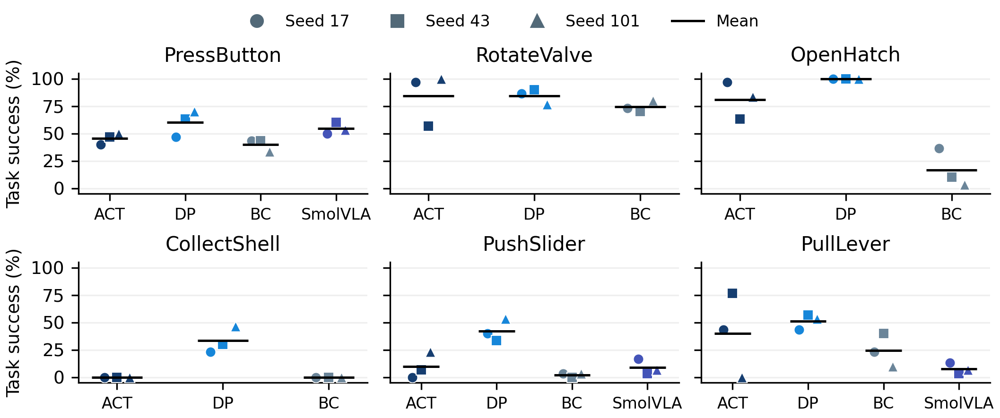
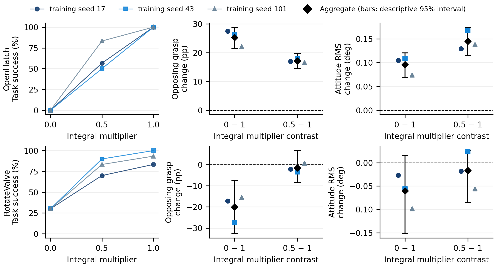
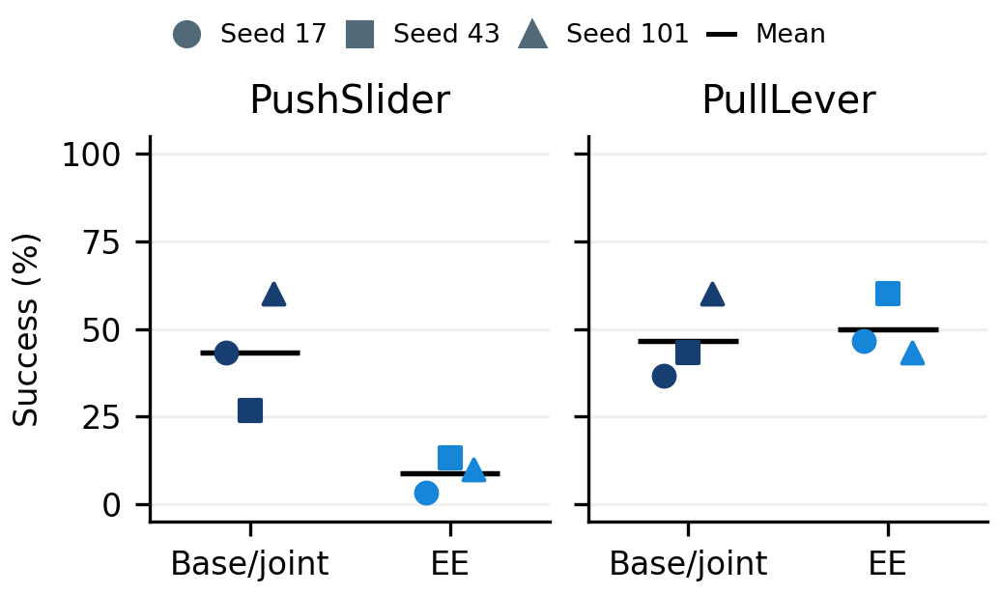
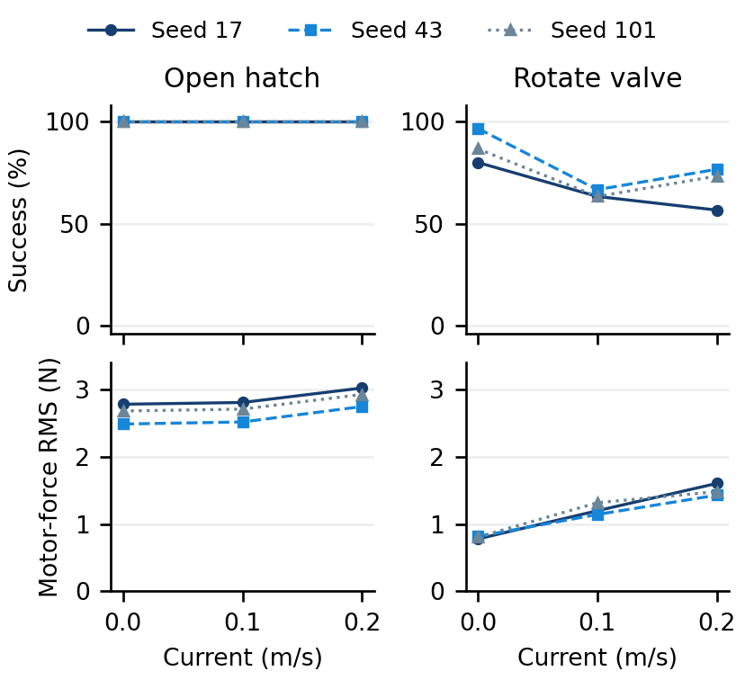

# Benchmark results

## Results

Success (%) · mean ± sample SD over **three trainings**, each evaluated on 30 resets.

| Task | ACT | DP | Chunked BC |
|---|---:|---:|---:|
| PressButton | 45.6 ± 5.1 | 60.0 ± 12.0 | 40.0 ± 5.8 |
| RotateValve | 84.4 ± 24.1 | 84.4 ± 6.9 | 74.4 ± 5.1 |
| OpenHatch | 81.1 ± 16.8 | 100.0 ± 0.0 | 16.7 ± 17.6 |
| CollectShell | 0.0 ± 0.0 | 33.3 ± 12.0 | 0.0 ± 0.0 |
| PushSlider | 10.0 ± 12.0 | 42.2 ± 10.2 | 2.2 ± 1.9 |
| PullLever | 40.0 ± 38.4 | 51.1 ± 6.9 | 24.4 ± 15.0 |

Equal training sample exposure does not equalize compute, encoders or observation
history. All runs, including failures, remain in the table. Zero sample SD is not
population certainty. These new procedural-asset results are separate from the
historical CAD-profile scores.

**Policy × control.** Removing integral action changes OpenHatch from 30/30 to
0/30 for every DP training seed and reduces completion on RotateValve. Early
grasp occupancy rises on Hatch and falls on Valve: contact alone does not order
completion. Seven conditions per task include published-coefficient sensitivity.

Controller and contact graphs

[All conditions and interpretation](https://github.com/dancher00/wasserman/releases/download/v0.1.0/wasserman-reproduction-sources-v0.1.0.tar.gz#docs/reviews/revision-v2-controller-review.md).

**Action interfaces.** On reserved research resets, native targets versus EE
produce 43.3% versus 8.9% on PushSlider. PullLever's +3.3 percentage-point EE
contrast remains unresolved. Expert replay passes both interfaces on both tasks.

Action-interface graphs

[Complete comparison and uncertainty](https://github.com/dancher00/wasserman/releases/download/v0.1.0/wasserman-reproduction-sources-v0.1.0.tar.gz#docs/reviews/revision-v2-interface-review.md).

**Water current.** Three frozen DP checkpoints per task, three current levels and
30 matched resets give 540 episodes. RotateValve changes from **87.8% to 64.4%**
at 0.10 m/s. OpenHatch retains full observed completion at 0.20 m/s while early
motor-force RMS increases **9.4%**. All levels and seeds are shown; the Valve
success response is not monotonic.

[Protocol, paired contrasts and videos](../docs/current-contact-study.md).

**Execution variation.** All 54 primary models were rerun on a second workstation.
The equal-task ordering DP > ACT > BC is preserved; mean shifts are −1.5, −0.4
and −1.9 percentage points, respectively. Individual binary outcomes agree in
1,438/1,620 episodes. [All task/model shifts](../docs/revision-v2-execution-impact.md).

## Task environments and platforms

These studies use separately versioned scenes and protocols. They are not
additional results of the open-core learning matrix.

Explore task-specific evaluations, two-arm manipulation and physical demonstrations

- **Nine evaluated tasks across separate protocols** — PressButton, RotateValve, OpenHatch, CollectShell,
  PushSlider, PullLever, HotStab, CabinRecovery and CargoRelease.
- **ACT and Diffusion Policy baselines** — RGB observations and measured robot
  state, selected checkpoints, per-state outcomes and scripted experts.
- **Floating vehicle–arm systems** — BlueROV2 with Reach Alpha for the six-task training comparison;
  RexROV2 with Oberon7 in a separate articulated PressButton comparison: **30/30 each**, with paired resets and independent trace replay.
- **Two-arm manipulation** — a custom twin-Oberon Rex compares cooperative valve
  turning, a support grasp and a parked arm: **30/30 in each mode**. The
  [scripted comparison](https://github.com/dancher00/wasserman/releases/download/v0.1.0/wasserman-reproduction-sources-v0.1.0.tar.gz#benchmarks/bimanual-valve-v1/RESULTS.md) measures base motion
  and motor load separately from the learned-policy benchmark.
- **Control interfaces** — end-effector targets and base/joint targets, inverse
  kinematics, and PID/PD comparisons with a frozen policy.
- **Dynamic delivery demonstration** — [Wall Toss](../docs/wall-toss.md): a capsule passes through a wall in still water and strikes the rim under cross-current with identical high-level commands. One paired expert example, without ACT/DP scores.
- **Underwater effects** — currents, drag, buoyancy, motor limits and optional
  boundary effects; visual water variations for inspecting image formation.
- **Controlled studies** — policy, interface, data-budget and physical-condition
  comparisons with recorded protocols and paired test states.

<strong>Historical ACT / DP results</strong> · nine tasks · versioned evaluation protocols

| Task | ACT | Diffusion Policy | Protocol |
|---|---:|---:|---|
| PressButton | 10/30 | 16/30 | Shared CAD-profile protocol |
| RotateValve | 30/30 | 30/30 | Shared CAD-profile protocol |
| OpenHatch | 10/30 | 30/30 | Shared CAD-profile protocol |
| CollectShell | 0/30 | 28/30 | Shared CAD-profile protocol |
| PushSlider | 0/30 | 28/30 | Shared CAD-profile protocol |
| PullLever | 6/30 | 22/30 | Shared CAD-profile protocol |
| HotStab | 2/30 | 0/30 | Separate pinned study |
| CargoRelease | 3/30 | 1/30 | Corrected shipwreck v3 |
| CabinRecovery | 0/30 | 0/30 | Corrected shipwreck v3 |

One training seed per model/configuration; 30 task-specific test states per row.
HotStab, CabinRecovery and CargoRelease use separate observation/training protocols and are
excluded from the six-task average. Cabin geometry audits pass 27/30 ACT and
30/30 DP episodes; failures remain in the denominator. See [task-specific study protocols](../docs/extended-studies.md). Original scores, repeat variation and study limits are retained
in [Tasks, studies and limits](../docs/benchmark.md).

  

[**Watch cooperative valve turning**](https://dancher00.github.io/wasserman/docs/artifacts/) · Three-minute expert demo, real time and silent. [Three-mode results and limits](https://github.com/dancher00/wasserman/releases/download/v0.1.0/wasserman-reproduction-sources-v0.1.0.tar.gz#benchmarks/bimanual-valve-v1/RESULTS.md).

[**Rapid-command demonstration**](https://dancher00.github.io/wasserman/docs/artifacts/) · One matched reset, three modes, no overturn. [Measured response and audit limitation](https://github.com/dancher00/wasserman/releases/download/v0.1.0/wasserman-reproduction-sources-v0.1.0.tar.gz#benchmarks/bimanual-fast-turn-v1/README.md).

